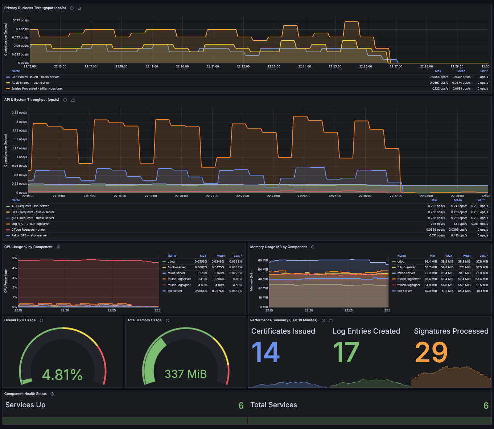

# TAS Baseline Infrastructure

This repository contains the infrastructure code for deploying a standardized Trusted Artifact Signer (TAS) baseline environment on OpenShift. The infrastructure is designed to be easily deployable and configurable for performance testing and monitoring.

## Overview

The TAS Baseline Infrastructure provides a complete setup for:
- Trusted Artifact Signer (TAS) components
- Monitoring and observability stack
- Performance testing capabilities
- Standardized resource configurations

## Prerequisites

- OpenShift cluster access
- `oc` CLI tool installed
- Ansible installed
- Python 3.x

## Components

The infrastructure includes the following main components:

1. **Core TAS Components**:
   - Fulcio (Certificate Authority)
   - Rekor (Transparency Log)
   - Trillian (Backend Database)
   - CTLog (Certificate Transparency Log)
   - TSA (Timestamp Authority)
   - TUF (The Update Framework)

2. **Monitoring Stack**:
   - Grafana for visualization
   - Prometheus integration
   - Custom dashboards for TAS performance KPIs

## Quick Start

1. Clone the repository:
   ```bash
   git clone https://github.com/kdacosta0/tas-baseline-infrastructure.git
   cd tas-baseline-infrastructure
   ```

2. Deploy the infrastructure:
   ```bash
   make deploy
   ```

## Available Make Commands

- `make deploy` - Deploy TAS baseline infrastructure
- `make cleanup` - Remove ALL TAS resources and operators
- `make cleanup-apps` - Remove only TAS applications (keep operators)
- `make check` - Verify prerequisites
- `make status` - Show deployment status

## Configuration

The infrastructure can be configured through `baseline-config.yml`. Key configuration areas include:

- OIDC settings (required)
- Certificate configurations
- Resource limits and requests
- Component enablement
- Monitoring settings
- Storage configurations

## Directory Structure

```
.
├── Makefile              # Build and deployment automation
├── baseline-config.yml   # Main configuration file
├── deploy-baseline.sh    # Deployment script
├── inventory.yml         # Ansible inventory
├── setup-baseline.yml    # Main Ansible playbook
└── roles/                # Ansible roles for deployment
```

## Monitoring

The infrastructure includes a comprehensive monitoring setup with Grafana dashboards that provide real-time insights into TAS performance and health metrics.

### Dashboard Overview


*Figure 1: TAS Performance Dashboard showing key metrics and system health indicators*

The monitoring stack includes:
- Grafana dashboards for performance KPIs
- Prometheus integration
- Custom metrics collection
- Resource utilization tracking

## License

This project is licensed under the terms included in the [LICENSE](LICENSE) file.
